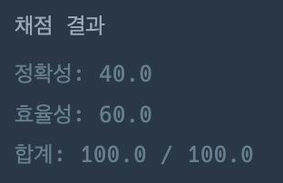
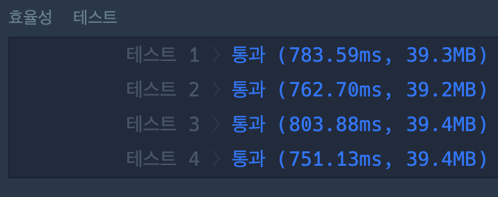
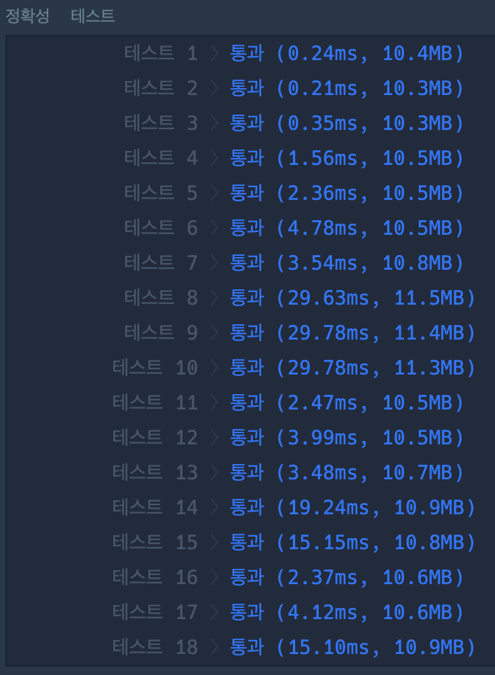
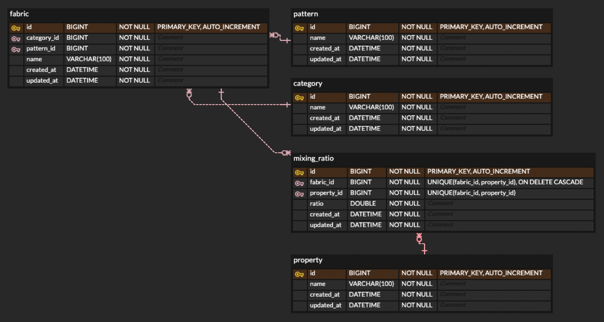

# 알고리즘
선택한 문제 : 문제 2(https://school.programmers.co.kr/learn/courses/30/lessons/72412)
언어 : python3

### 채점 결과

# 백엔드 과제

database : mysql
설계 도구 : erdcloud(https://www.erdcloud.com/)
링크 : https://www.erdcloud.com/d/jkK5rB362YQu9eLYn

원단 테이블 : fabric
패턴 테이블 : pattern
카테고리 테이블 : category
혼용률 테이블 : mixing_ratio
원단 상품을 구성하는 재료 테이블 : property